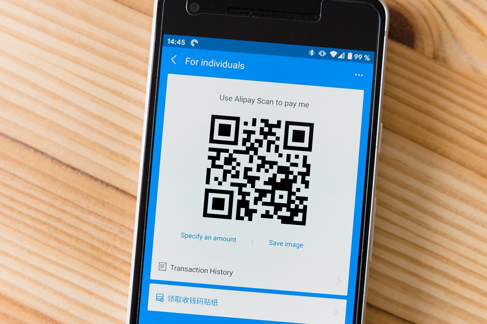

Building  Barcode /Qrcode Scanner
--------
<https://github.com/Tafadzwa-traceComputerVision_Qrcode>




----------------
Introduction
----
From floors, ceilings to bathroom stall doors ,these are just a few of the places you'll find QR codes. In fact, they've become so ever-present that[45% of shoppers](https://blog.hubspot.com/blog/tabid/6307/bid/29449/how-to-create-a-qr-code-in-4-quick-steps.aspx) used marketing-related QR codes in 2021.There's no denying the popularity and convenience of the QR code. But what exactly is it? Why is it so popular? How can you create one for your next marketing campaign?For our project we thought QR codes/ Barcodes are very cool and interesting because they store information in a different format. The fun part about them is we can’t really tell what they are storing until we scan them. It’s like playing a puzzle game. And one more thing that we like about them is they can be part of the physical world and still connect us to the internet world.

Building a Barcode / QR Code Scanner 
---

In this project we are going to build a qr code scanner and in order to do  so a deeper  and robust understanding of qr codes is needed.The use of qr codes ,invented by [Denso wave](https://www.denso-wave.com/en/), has risen greatly ,for instance according to Forbes since the pandemic began qr codes have risen by [11%  in US](https://www.forbes.com/sites/forbesagencycouncil/2021/04/13a-touchless-world-qr-codes-and-their-growth-in-north-america) only.Them being used in [seamless payments to financial information delivery](https://www.pymnts.com/consumer-payments-2/2021/retail-adoption-qr-codes-security-touchless-payments/) ,hotels ,hospitals ,restaurants  and online-to-offline marketing , this clearly shows why they are most preferably used in [China](https://a16z.com/2017/08/11/qr-codes-in-china/) ,according to [CNN Tech](https://money.cnn.com/2017/09/08/technology/china-qr-codes/index.htm), USD 1.65 Trillion in transactions was done via QR Codes in [China in 2016](https://scanova.io/blog/qr-code-statistics/).AS QR readers are now native to smartphone cameras, users no longer need to download a separate app to scan a code this has contributed greatly to their use. This project is mainly focused on using OpenCV  and pyzbar to build a qr code scanner.

What is a qrcode
----
It is two-dimensional version of the Barcode which is able to convey a wide range of information  instantly with the scan of a mobile device .It stores up to 7089 digits or 4296 characters.When designing the Static QR Codes more data is added and the bigger the size the more complex the structure becomes .It can take up to [30%  damages  of the Code]( https://www.qr-code-generator.com/qr-code-marketing/qr-codes-basics/) structure without affecting its  readability.According  to [Hara and his team](https://en.wikipedia.org/wiki/Denso), the white to black areas’ ratio are reduced to patterns on printed material  ratio [1:1:3:1:1](https://www.qr-code-generator.com/qr-code-marketing/qr-codes-basics/).QR codes often contain data for a locator, identifier, or tracker that points to a website or application .A QR code use four standardized encoding modes (numeric,alphanumeric,byte/binary, and kanji) to store data efficiently; extensions may also be used .They consist of

    -Position detectors - identify presence and orientation
    Located at three corners of each code allowing a scanner to accurately recognize and read code at high speed  indicating the printed direction of the Code.

    -Alignment markers
    Smaller than the position detection markers, help straighten out QR Codes curved surfaces.  The more the information on Code , the larger it becomes and the more alignment patterns it  need it.

    -Timing pattern
    Alternating black/white modules helping to configure data grid ,using these lines, the 	scanner determines how large the data matrix is.

    -Version Information
    Currently 40 different QR Code versions available, these markers specify the one used.

    -Formation Information
    Contain information about the error tolerance and the data mask pattern making it easier to scan.

    -Data and error correction keys
    Mechanism inherent in the QR Code structure , all your data is contained here and shares the space with the error correction blocks that allow up to 30% of the Code to be damaged

    -Quiet zone
    Similar to the importance of white space in design, offering structure and improving comprehension.The quiet zone is vital  in order to distinguish the QR Code from its surroundings.
As shown below:


Not every QR code is shaped like a perfect square. Sometimes they have[unique patterns, colors, and logos](https://blog.hubspot.com/blog/tabid/6307/bid/29449/how-to-create-a-qr-code-in-4-quick-steps.aspx)displayed inside. You'll find them in non-digital spaces like direct mail, signage, billboards, and even TV shows where you can scan the code on the screen using your phone

How qrcode  work
----
Originally designed in Japan for use in the automotive industry, marketers adopted the QR code because of its large storage capacity and ability to translate additional information to consumers beyond what the packaging or advertising of a product could display.Let's say a consumer sees a QR code. They can take out their mobile device, download a free QR code scanning app, or simply use their phone's camera, and scan the QR code to gain more information about what they saw.If you wanted to create, say, a bus stop advertisement promoting your podcast, you could display a QR code on that printed ad that brings people right to your iTunes page when they scan it with their phones. Pretty simple, right.

Qr codes consist of 7 parts ,each part having a pixel pattern which looks similar to  a crossword puzzle
Each element conveys certain information through the Code  like print direction, timing, error tolerance and empty spaces differentiating the Code its surroundings .It is processed using [Reed–Solomon](https://en.wikipedia.org/wiki/Reed%E2%80%93Solomon_error_correction)  error correction until the image can be appropriately interpreted.Steps of [encoding](https://www.thonky.com/qr-code-tutorial/introduction):

1.[Data analysis](https://www.thonky.com/qr-code-tutorial/data-analysis)

2.Data Encoding

3.Error correction Coding

4.Structure Final Message

5.Module Placement Matrix

6.Data Masking

7.Format and version Formation

What is a barcode
---
[According to Denso Wave](https://www.denso-wave.com/en/adcd/fundamental/barcode/barcode/index.html),it is a machine readable representation of numerals and characters and it consist of bars and spaces.Mainly used in supermarkets ,convenience stores and other ubiquitous . It can be read by a barcode scanner and is applied to products so that they can be easily identified.[It's components consist of](https://www.denso-wave.com/en/adcd/fundamental/barcode/barcode/index.html)

    -Quiet Zone
    Also known as the margin.It is black located at either end of the barcode with a minimal margin of 2.5mm.If width is insufficient it becomes difficult to scan.

    -Start / Stop character
    It represents the start and end of data respectively.Characters differ depending on the barcode type.

    -Check Digit
    Also known as the symbol check character.It checks wether the encoded data is correct.


How  a barcode works
---
The black and white  bars combination ,elements in short, represents varying text characters that have an algorithm which is already pre-established for that specific code.The barcode scanner then read this pattern and translate it into a line of test that the [retail point of system](https://www.lightspeedhq.com/pos/retail/holiday/) understands.


QR Code Vs Barcode
---
QR codes and barcodes are similar in that they are both visual representations of data, but how the information stored within them is read sets them apart. Barcodes are one-dimensional and the data stored in them is read horizontally. QR codes are two-dimensional and the data stored in them is [read horizontally and vertically](https://blog.hubspot.com/blog/tabid/6307/bid/29449/how-to-create-a-qr-code-in-4-quick-steps.aspx). Both barcodes and QR codes can be scanned using a laser or a smartphone as long as the tool being used has the correct capabilities of reading vertical and horizontal data. Although most smartphones scan QR codes automatically, many won't scan barcodes so easily — you'll need a [special app](https://blog.hubspot.com/blog/tabid/6307/bid/29449/how-to-create-a-qr-code-in-4-quick-steps.aspx) for that.

A matter of dimensions
Their main difference is physical dimensions. Barcodes can be scanned in a line limiting what can be placed in that one stretch of stripes. QR codes, add  a dimension from which information can be written and scanned that can  be read both vertically and horizontally ,instead of a single line.

As blog [Schooldude notes](https://www.dmsiworks.com/resources/erp-news/inventory-management/barcodes-vs-qr-codes-which-is-better-for-manufacturers/), a company can store more information in a single QR code than in a barcode. For example, a standard barcode can only be able to tell a product number and expected location whereas a QR code is be able to provide the condition of the product, date of manufacture,  repairs needed and much more.Hence a business is able to get  more precise understanding of the state of their inventory.

However , the main drawback of qr codes as noted below , is their inability to be scanned because the devices used are [quiet expensive](https://www.dmsiworks.com/resources/erp-news/inventory-management/barcodes-vs-qr-codes-which-is-better-for-manufacturers/) and [they are ugly](https://www.digitaloperative.com/blog/2017/the-death-of-qr-codes-and-the-rise-of-new-technology).They don't excactly fit in some products design.


How qrcode scanner work
----

QR scanners read both the data codewords and the error correction codewords. By comparing the two, the scanner can determine if it read the data correctly, and correct errors if it did not read the data correctly.QR scanners read both the data codewords and the error correction codewords. By comparing the two, the scanner can determine if it read the data correctly, and correct errors if it did not read the data correctly. Detecting a QR code revolves around identifying finder patterns. The key idea is that there's a ratio in the number of black/white/black/white/black. And this ratio remains the same no matter what angle you look at it.

Libraries
---------

We used a regular code editor and installed three libraries: Pillow, OpenCV and Pyzbar. Pillow library is also known as PIL, which stands for Python Image Library. [OpenCV](https://docs.opencv.org/3.4/) is a well-known library, especially when working with computer vision projects,[Webbrowser](https://docs.python.org/3/library/webbrowser.html) which  provides a high-level interface  allowing displaying web-based documents to users. And lastly [Pyzbar](https://pypi.org/project/pyzbar),[Pillow](https://pypi.org/project/Pillow/)    , a python library that will help us read the barcode and QR codes.

____
Code
----
    #pip install opencv
    #pip  install webbrowser 
    #pip install pyzbar
Install libraries

```
import cv2
from pyzbar import pyzbar
import webbrowser
```
Now lets write a function a decoding function

Decoding function
---
Here we write the decoding function which is mainly responsible for three things.

1.Barcode/Qr code recognition and decoding which will be showing on the camera

2.Stored information that is recognised on the qrcode or barcode is added as text on the qr/bar code

3.Exporting the information stored as a text document

```

def read_barcodes(frame):
    barcodes = pyzbar.decode(frame)
    for barcode in barcodes:
        x, y , w, h = barcode.rect
        #1
        barcode_info = barcode.data.decode('utf-8')
        cv2.rectangle(frame, (x, y),(x+w, y+h), (0, 255, 0), 2)
        
        #2
        font = cv2.FONT_HERSHEY_DUPLEX
        cv2.putText(frame, barcode_info, (x + 6, y - 6), font, 2.0, (255, 255, 255), 1)
        #3
        with open("barcode_result.txt", mode ='w') as file:
            file.write("Recognized Barcode:" + barcode_info)
        webbrowser.open(str(barcode_info))
    
    return frame
```
Understanding the decoding function
---

Firstly , we decode the information on the qr / bar code  , then draw a rectangle around it to confirm if the machine has detected it.

Then ,we add text on top of the rectangle which shows the decoded information

Lastly , we export the information into a text document and add the string to open link on web browser

Main Function
---
Here ,the main function is where the application works. It turn on the video camera on the computer ,then call the decoding function and read the decoded text to load a website for the qr code.

```

def main():
    
    camera = cv2.VideoCapture(0 ,cv2.CAP_DSHOW)
    ret, frame = camera.read()
    
    while ret:
        ret, frame = camera.read()
        frame = read_barcodes(frame)
        cv2.imshow('Barcode/QR code reader', frame)
        if cv2.waitKey(1) & 0xFF == 27:
            break
    
    camera.release()
    cv2.destroyAllWindows()

if __name__ == '__main__':
    main()
```

Understanding the main function
----
Firstly ,we turn on the camera using opencv , note if have an external camera change value from 0 to 1.

Then , we run the while loop to running the decoding function continuously.Press Esc to exit.

After that we load the website for the qrcode ,then we release the camera we turned on and close the window for the application

Lastly ,call main fuction to trigger program.

___

[](https://www.canva.com/design/DAE0YkfGWDo/iNNiAB7Fo2iEdG_SpfnSqQ/view?utm_content=DAE0YkfGWDo&utm_campaign=designshare&utm_medium=link&utm_source=publishsharelink)

Advantages of QR codes
---

1.Quick and error-free
   
If not QR Codes, the only way to connect consumers to online content is by using a URL. But typing a URL is time-consuming and inconvenient on a mobile screen. Consumers are also likely to make errors while typing. Compared to this, scanning a QR Code is a much faster and error-free process.In 2015, Chicago-based Wintrust Financial and technology provider FIS launched about 200 ATMs. These ATMs have QR Code-based cardless transaction capabilities.Customers can withdraw money simply by scanning a QR Code at the ATM screen using their Wintrust app.According to [Wintrust and FIS](https://paymentweek.com/2015-1-19-wintrust-rolls-out-cardless-cash-atms-powered-by-fis-6400/) , QR Code-based cardless cash withdrawal takes only 8 seconds compared to 47 seconds for normal withdrawal.This shows that QR Codes are faster and convenient for the user.This is one of the key reasons why QR Codes [are so popular in China](https://scanova.io/blog/blog/2016/02/16/advantages-of-qr-code).

2.[More informative]( https://scanova.io/blog/blog/2016/02/16/advantages-of-qr-code/#:~:text=Nestle%20Maggi%20using%20QR%20Code%20on%20packaging%20to%20win%20back%20trust)

Unlike online marketing, print-based marketing has limitations. Particularly in real estate space. There is only so much you can do in a newspaper ad, product packaging, and brochure, right? Wrong. With QR Codes, you can give consumers a way to access unlimited information. In 2015, Nestle’s popular product in India – Maggi noodles – got banned. It was due to claims by authorities that it contained impermissible levels of lead.The ban was soon lifted but Nestle knew that people now had trust issues. To regain their trust, Nestle took various steps to prove its compliance with people’s health and law. To do it, they shared a detailed list of ingredients and other important information with customers. This could be on safety, environment, society, and recipes.Obviously, it could not print all of this on the packaging. So the company added a QR Code which led buyers to the mobile site that had all this information. 

3.[Engaging with rich content](https://blog-trycontechnologi.netdna-ssl.com/blog/wp-content/uploads/2015/11/IMG_8613.jpg)

Words are good. A picture is worth a thousand words.But a video has thousands of pictures. Audio is also more convenient. But unfortunately, you can share these forms of rich content via print promotions—unless you add a QR Code.Using QR Codes, marketers can share rich content via their print promotions. Thus, they will see better engagement from their audience. For example, packaged food company Chef’s Basket added a QR Code on the packaging of one of its pasta products. When scanned, the QR Code redirects the consumers to a video of the recipe of the pasta dish.

4.Actionable

While print media still works well for branding, it is not interactive like outdoor or digital marketing. But with QR Codes, it can be.By adding a QR Code, you can make your promotions interactive and take inputs from your target audience. You can run a contest, get people to register for a product or event, take feedback, or allow your customers to make purchases right from the newspaper ad or flyer.A good example is ‘World Park’, a QR Code-based campaign that was run in New York City’s Central Park in 2010.  QR Codes on boards were placed in different locations in the park. When scanned, the QR Codes engaged visitors in a Quiz on the park’s history, pop culture, art and music, and science and geology. 

5.Trackable

If you are a marketer, then you know the importance of analytics. It helps you gain valuable insights into your audience. Thus, helping you identify areas of strength and weakness.But print media, on its own, has no tracking abilities, unlike digital media. This is where QR Codes help you out.  QR Codes help you gauge the impact of print media marketing efforts by letting you track their [scanning activity](https://scanova.io/blog/qr-code-tracking/?utm_source=dk_sd_advantages-of-qr-code_bod&utm_medium=blog&utm_campaign=content). For example, how many people have scanned it, when did they scan it, and where did they scan it.In addition to this, it also offers a feature called event tracking. It tells you how people interact with the content encoded in the QR Code after scanning it. For example, it could be clicking on a button that says ‘Sign-up’ or ‘Register Now’.With this data, you can optimize your future campaigns better.

6.[Easy to save](https://scanova.io/blog/blog/2016/02/16/advantages-of-qr-code/#:~:text=make%20your%20business%20card%20dynamic%20and%20exciting)
   
Another advantage of QR Codes is that the user can easily save the data on their smartphones.For example, if you scan a Dynamic vCard QR Code, a mobile page with your contact details will open. The page features a ‘Add to Contacts’ button which allows the user to directly save the contact in their smartphone.


___
Shortcomings of qr codes 
----
✧Smartphones used to scan QR codes are often   expensive and costly in comparison with simpler phones.

✧Many users that have mobile phones, do not have smartphones, that have cameras that are unable to get QR reading software for their phone

✧ Not very aesthetic, it contains random patterns of square boxes which might not look pleasing on products, unlike 1-d barcodes.

✧To make changes to QR codes, one needs to create an entirely different code.

✧[They are ugly](https://www.digitaloperative.com/blog/2017/the-death-of-qr-codes-and-the-rise-of-new-technology)


Solution for the shortcomings
----
1.NFC tags
  [Near Field Communication](https://www.digitaloperative.com/blog/2017/the-death-of-qr-codes-and-the-rise-of-new-technology) which does not require an extra application comes already built in smartphones . If a smartphone has NFC enabled, all someone has to do is touch or tap their smartphone against the NFC tag for the desired action to take place but this does not solve the issue of needing to have a smartphone , iphone users.Unlike Qr codes  they can be edited easily ,all is needed is to overwrite the old information

2.SnapTag
[SnapTags ](https://resources.chromotek.com/blog/snap-tag-and-clip-tag-overview) ,  which are prettier than Qr codes.Similar to QR codes that is  they are scannable images that access additional information marketers want consumers to know about since consumers are attracted to colors and interesting designs and qr code black and white square often looks out of place and tends to clash with the design.They also don’t require an extra application.SnapTagscan seamlessly integrate e within the design of the overall product and scanned.

Conclusion
----

QR code stores more information than BARcodes. QR Code stores the information matrix form which stores the information on both axes horizontally or vertically. QR code has many advantages like as they are free to generate and easy to scan.Although QR codes are very flexible and have been around for over eighteen years, their use in many fields like medical ,business, education, security are still in their infancy. It is of great significance to improve the recognition rate of the QR code in special circumstances, especially on papers, and the improvement of the recognition rate can also greatly promote the application of QR codes.

Qrcodes may seem to be ugly or do not align well with many business logos ,but their ugliness can also be used as an advantage because world wide some people don’t know them and their structure on its own draws curiosity.Indeed , for a person to use a qrcode ,they must own a smartphone which is a little bit expensive given the average salary a person can get example in [Rwanda, average annual salary: $744 (£576)](https://www.lovemoney.com/gallerylist/79056/what-the-average-person-earns-in-different-countries-around-the-world) but as we can see the world is becoming technologically advanced  and its only a matter of time before almost everyone can afford a smartphone .As we can see developers of smartphones  are also trying to integrate qrcodes with smartphones for easy usability.Nowarday a person doesn’t need to download an application to scan a qrcode ,as long as your smartphone has a camera it can be scanned for the later versions of smartphones.

To say qr codes can replace barcodes is an understatend , as barcodes are still very useful.They can be used when simple information is needed hence cutting expenses and providing exact information in business platforms.We can only hope for advancement of barcodes development so that they can maximise their full use working hand in hand with qr codes.
